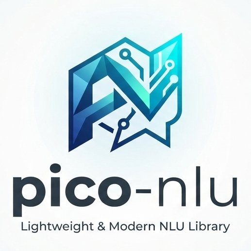

# pico-nlu
<p align="center">
  
</p>

`pico-nlu` is a from-scratch Natural Language Understanding library derived from
[Snips NLU](https://github.com/snipsco/snips-nlu), with simplifications and modernizations:
no Rust binary dependencies, Python 2 shims removed, and a cleaner plugin-free architecture.

It supports intent classification, deterministic gazetteer-based entity extraction, and
neural (BiLSTM-CRF) slot filling for open/contextual entities.

## Install

**Default (classical):** intent classification + gazetteer entities.

```bash
pip install pico-nlu
```

**With neural extra:** adds BiLSTM-CRF sequence labeling.

```bash
pip install pico-nlu[neural]
```

## Capability tiers

| Tier | What you get |
|---|---|
| `pip install pico-nlu` | Intent classification (Logistic Regression) + deterministic gazetteer entity extraction. |
| `pip install pico-nlu[neural]` | The above, plus BiLSTM-CRF sequence labeling for entities only annotated in training data. |

This tiering is intentional and preserved across all releases.

## Quick start

```python
from pico_nlu import Engine

engine = Engine(language="en")
engine = engine.fit(dataset)
result = engine.parse("turn on the kitchen light")
```

## Documentation

- Architecture & conventions: [`ARCHITECTURE.md`](./ARCHITECTURE.md)
- Contributing guide: [`CONTRIBUTING.md`](./CONTRIBUTING.md)
- Product requirements: [`prd/`](./prd/)

## License

Apache-2.0. See [`LICENSE`](./LICENSE).
